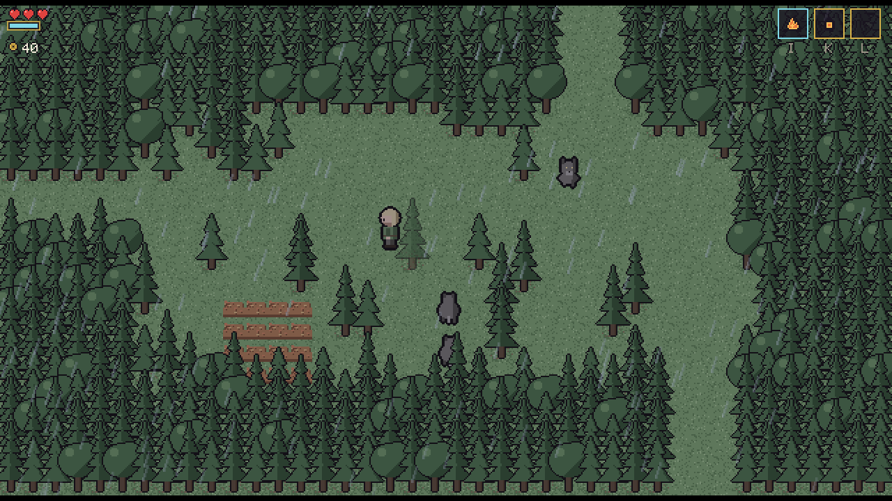

# Fimbulvetr



A top-down action-adventure in the mould of _A Link to the Past_, set in a Norse-myth world. It runs entirely in the browser.

**[Play it in your browser](https://erikhellman.github.io/Fimbulvetr/)**, deployed on GitHub Pages.

[Ask](https://en.wikipedia.org/wiki/Ask_and_Embla), a farmhand, sets out to rescue [Embla](https://en.wikipedia.org/wiki/Ask_and_Embla), the farmer's daughter, and the villagers taken in a night raid. They were taken by the servants of [Hrímnir](https://en.wikipedia.org/wiki/Hr%C3%ADmnir), the Rime King, a [jötunn](https://en.wikipedia.org/wiki/J%C3%B6tunn) bound beneath the mountains whose binding is failing. Along the way the seasons turn, the weather rolls in and night brings out things that hunt. When the Rime King's breath finally pours over the lowlands, it brings the Fimbulvetr, the [great winter](https://en.wikipedia.org/wiki/Fimbulwinter).

> **Status:** version 1.0.0. The whole game is playable from the raid on Askdalr to the Rime King and the spring after, with eight regions, eight dungeons, 25 side quests, 36 heart pieces and 24 achievements. See [`docs/roadmap.md`](docs/roadmap.md) for what is left to playtest.

## How to play

Choose **New game** on the title screen. A short page shows the controls first (it can be turned off in the settings).

- **Explore and talk.** People in Askdalr and beyond give quests, trade and hints. The pause menu's Quests page tracks what you have been asked, and the map shows where you have been.
- **Fight with the right tool.** Watch an enemy's tell, then strike, roll away or raise your shield. Many foes and most puzzles want a particular item or galdr (a sung spell).
- **Mind the world.** Seasons, weather and the hour change paths, enemies and what people say. Sleep in a bed to pass the night. The high cold bites, so come prepared.
- **Find the hidden things.** Four heart pieces make a heart. Bragi the skald sells verses that hint at the best-hidden ones.
- **Save often.** The game saves on its own when you move between screens. Save to a slot at a hof or a mead hall, and use **Export** on the title screen to keep a copy as a file.

The settings menu holds the language (English or Swedish), the volume, the text size, key bindings and the accessibility options: colour-blind aid, no screen shake, no lightning flashes, a shield that stays up on a tap, and long days.

## Goals

The full design is in [`Fimbulvetr-game-design-document.md`](Fimbulvetr-game-design-document.md). In short:

- **Every screen has a reason.** Exploration pays off with items, secrets or story, never empty tiles.
- **Combat is readable.** Clear telegraphs and short animations, no stat spreadsheets. Skill and the right tool beat grinding.
- **The world turns.** Four seasons, five weather types and a day-night cycle change what you can reach and what hunts you. NPCs and the village react to the story and the calendar.
- **Lean by design.** Loads in under 5 s, stays under 150 MB of RAM and holds 60 fps on integrated graphics in Chrome, Firefox and Safari.

The target is a 15–20 hour main quest with 8 overworld regions, 8 dungeons and 9 bosses, about 45 named NPCs and around 25 side quests. All text is bilingual: English and Swedish.

The project is also an experiment in building a complete game solo with [Claude Code](https://claude.com/claude-code). The roadmap is split into AI-sized milestones, and every rule of the game lives in a deterministic, heavily tested pure-TypeScript core. The placeholder art and sound effects are generated in code, so the game is fully playable before any hand-made art exists.

## Tech

- [Phaser 4](https://phaser.io/) (WebGL) for rendering, input and audio, kept to a thin shell.
- Strict TypeScript and [Vite](https://vite.dev/). The game installs as a PWA.
- A pure, deterministic simulation (`src/core`) with no Phaser, no DOM and no wall-clock time. That makes the whole game testable headlessly, down to full playthroughs of each milestone.
- Saves live in the browser (IndexedDB). They can be exported and imported as files. Nothing is sent to a server.

[`ARCHITECTURE.md`](ARCHITECTURE.md) describes the layers, the frame loop and the key modules.

## Running locally

### Requirements

- [Node.js](https://nodejs.org/) 22.14 or newer.
- [pnpm](https://pnpm.io/) 10. With Corepack you can run `corepack enable` and the version pinned in `package.json` is used.
- A desktop browser with WebGL: Chrome, Firefox or Safari 15.4 or newer.

### Start the game

```sh
pnpm install
pnpm dev
```

Then open the URL that Vite prints (usually <http://localhost:5173>).

### Controls

| Action           | Keyboard           | Gamepad      |
| ---------------- | ------------------ | ------------ |
| Move             | WASD / arrow keys  | D-pad        |
| Sword            | J                  | X            |
| Items            | K, L               | B, Y         |
| Galdr (spell)    | I                  | RT           |
| Roll             | Space              | RB           |
| Shield           | Shift              | LB           |
| Interact/confirm | E / Enter          | A            |
| Pause menu / map | Tab / M            | Start / Back |

All bindings can be changed in the settings menu.

### Dev shortcuts

In dev builds the query string can jump straight to a place, time or story checkpoint, for example:

```
http://localhost:5173/?screen=test_a&at=20,11&season=winter&time=22:00&nosave
http://localhost:5173/?preset=uppvik
```

F1 toggles a debug overlay and the backquote key (`` ` ``) opens a dev console (type `help`). See the "Dev and test tools" section in [`ARCHITECTURE.md`](ARCHITECTURE.md) for every option and preset.

### Checks, tests and builds

| Command        | What it does                                               |
| -------------- | ---------------------------------------------------------- |
| `pnpm check`   | Typecheck, ESLint, Prettier check and the Vitest suite.    |
| `pnpm test`    | Only the Vitest suite.                                     |
| `pnpm e2e`     | Playwright end-to-end tests on Chromium and WebKit.        |
| `pnpm build`   | Production build into `dist/`.                             |
| `pnpm preview` | Serve the production build locally.                        |
| `pnpm budget`  | Check the gzipped JS size budget (run after `pnpm build`). |

The first time you run the end-to-end tests, install the browsers with `pnpm exec playwright install chromium webkit`.

## Project layout

```
src/core     rules and simulation (pure TypeScript, deterministic)
src/content  typed game data: screens, items, dialogue, quests, tuning
src/art      generated placeholder art and sound
src/shell    Phaser scenes, views, input, audio, storage, dev tools
tests/       Vitest units, headless sim scenarios and Playwright e2e
docs/        design spec, roadmap, milestone briefs and plans
```

## License

[MIT](LICENSE) © 2026 Erik Hellman
